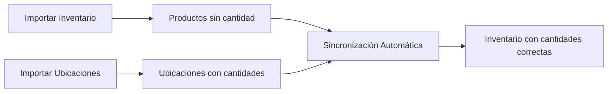

# 📊 GUÍA DE IMPORTACIÓN - FORMATOS OPTIMIZADOS

## 🎯 NUEVO SISTEMA DE IMPORTACIÓN LÓGICA

El sistema ahora maneja las importaciones de forma más lógica y automática:

### 📦 IMPORTACIÓN DE INVENTARIO (SIN CANTIDADES)

**Archivo Excel requerido para inventario:**
```
| Modelo    | Tipo        | Nombre              | Precio |
|-----------|-------------|---------------------|--------|
| CAD001    | Cadena      | Cadena Industrial   | 25.50  |
| ROD002    | Rodamiento  | Rodamiento 6204     | 15.75  |
| TOR003    | Tornillo    | Tornillo M8x20      | 0.85   |
```

**✅ CAMBIOS IMPORTANTES:**
- ❌ **NO incluir columna "Cantidad"** en el archivo de inventario
- ✅ Las cantidades se calculan **automáticamente** desde las ubicaciones
- ✅ Sincronización automática después de importar
- ✅ Cache optimizado para carga rápida

### 🏢 IMPORTACIÓN DE UBICACIONES (CON CANTIDADES)

**Archivo Excel requerido para ubicaciones:**
```
| Modelo    | Almacen      | Estanteria | Cantidad | Comentarios        |
|-----------|--------------|------------|----------|--------------------|
| CAD001    | Principal    | A1         | 10       | Stock principal    |
| CAD001    | Secundario   | B2         | 5        | Respaldo          |
| ROD002    | Principal    | C3         | 20       | Pedido reciente   |
| TOR003    | Almacén 1    | D4         | 100      | A granel          |
```

**✅ CAMPOS EXPLICADOS:**

1. **Modelo** (requerido): Debe coincidir con productos del inventario
2. **Almacen** (requerido): Nombre del almacén o depósito
3. **Estanteria** (requerido): Ubicación específica (pasillo, rack, etc.)
4. **Cantidad** (requerido): Cantidad física en esa ubicación
5. **Comentarios** (opcional): Notas adicionales sobre la ubicación

### 🔄 FLUJO AUTOMÁTICO DE SINCRONIZACIÓN



### 📋 NOMBRES DE COLUMNAS FLEXIBLES

El sistema reconoce múltiples variaciones de nombres:

**Para INVENTARIO:**
- Modelo: `Modelo`, `modelo`
- Tipo: `Tipo`, `tipo`
- Nombre: `Nombre`, `nombre`
- Precio: `Precio`, `precio`

**Para UBICACIONES:**
- Modelo: `Modelo`, `modelo`, `Material`, `material`, `Producto`, `producto`
- Almacén: `Almacen`, `Almacén`, `almacen`, `almacén`, `Deposito`, `deposito`
- Estantería: `Estanteria`, `Estantería`, `estanteria`, `estantería`, `Ubicacion`, `Ubicación`, `Pasillo`, `pasillo`, `Rack`, `rack`
- Cantidad: `Cantidad`, `cantidad`, `Qty`, `qty`, `Stock`, `stock`
- Comentarios: `Comentarios`, `comentarios`, `Observaciones`, `observaciones`, `Notas`, `notas`

### 🎯 BENEFICIOS DEL NUEVO SISTEMA

1. **🏆 Lógica empresarial correcta**: 
   - Ubicaciones = fuente de verdad para cantidades
   - Inventario = catálogo de productos

2. **⚡ Automático**: 
   - Sincronización instantánea
   - No intervención manual necesaria

3. **🛡️ Consistencia garantizada**: 
   - Imposible tener cantidades incorrectas
   - Validaciones automáticas

4. **📊 Flexibilidad**: 
   - Múltiples ubicaciones por producto
   - Tracking granular de stock

### ⚠️ MIGRANDO ARCHIVOS EXISTENTES

**Si tienes archivos antiguos con cantidad en inventario:**

1. **Archivo de inventario**: Elimina la columna "Cantidad"
2. **Crear archivo de ubicaciones**: 
   - Usa la cantidad del inventario anterior
   - Asigna almacén y estantería (ej: "Principal", "A1")
   - Importa ubicaciones después del inventario

### 📝 EJEMPLO PRÁCTICO

**Antes (formato antiguo):**
```
inventario.xlsx:
Modelo | Tipo | Nombre | Precio | Cantidad
CAD001 | Cadena | Cadena Industrial | 25.50 | 15
```

**Ahora (formato optimizado):**
```
inventario.xlsx:
Modelo | Tipo | Nombre | Precio
CAD001 | Cadena | Cadena Industrial | 25.50

ubicaciones.xlsx:
Modelo | Almacen | Estanteria | Cantidad | Comentarios
CAD001 | Principal | A1 | 10 | Stock principal
CAD001 | Secundario | B2 | 5 | Respaldo
```

**Resultado automático:**
- Inventario muestra: CAD001 con cantidad total = 15 (10+5)
- Ubicaciones muestran: 2 registros con ubicaciones específicas
- Sistema sincronizado y consistente

### 🚀 ¡EL SISTEMA ES MÁS INTELIGENTE AHORA!

Con estos cambios, el sistema maneja automáticamente:
- ✅ Cantidades siempre correctas
- ✅ Múltiples ubicaciones por producto  
- ✅ Tracking granular de stock
- ✅ Sincronización en tiempo real
- ✅ Prevención de errores humanos
