# 🏗️ Arquitectura y Patrones de Diseño - TotalStock

## 📚 Introducción

Este documento explica la **arquitectura general** del sistema TotalStock, los **patrones de diseño** utilizados, y las **decisiones técnicas** tomadas durante el desarrollo. Es una guía para entender el "por qué" detrás de cada decisión arquitectónica.

---

## 🎯 Arquitectura General del Sistema

### **Modelo de Capas (Layered Architecture)**

```
┌─────────────────────────────────────────┐
│           🎨 PRESENTATION LAYER         │
│         (UI/Interfaz de Usuario)        │
│   - Pantallas (login.py, principal.py) │
│   - Widgets de Flet                     │
│   - Gestión de eventos                  │
└─────────────────────────────────────────┘
                      ↓
┌─────────────────────────────────────────┐
│           🧠 BUSINESS LOGIC LAYER       │
│            (Lógica de Negocio)          │
│   - CRUD operations                     │
│   - Validaciones                        │
│   - Reglas de negocio                   │
└─────────────────────────────────────────┘
                      ↓
┌─────────────────────────────────────────┐
│           🗄️ DATA ACCESS LAYER           │
│            (Acceso a Datos)             │
│   - Firebase integration                │
│   - Local file management              │
│   - Configuration persistence          │
└─────────────────────────────────────────┘
                      ↓
┌─────────────────────────────────────────┐
│           💾 DATA LAYER                 │
│               (Datos)                   │
│   - Firebase Firestore                 │
│   - Local JSON files                   │
│   - User configurations                │
└─────────────────────────────────────────┘
```

### **¿Por qué esta arquitectura en capas?**

1. **Separación de responsabilidades**: Cada capa tiene una función específica
2. **Mantenibilidad**: Cambios en una capa no afectan otras
3. **Testabilidad**: Cada capa se puede testear independientemente
4. **Escalabilidad**: Fácil agregar nuevas funcionalidades

---

## 🧩 Patrones de Diseño Implementados

### 1. **Singleton Pattern** - Gestión de Sesión

```python
# app/funciones/sesiones.py
_usuario_actual = None  # ← Variable global única

class SesionManager:
    """Patrón Singleton para manejar la sesión única del usuario"""
    
    @staticmethod
    def establecer_usuario(usuario_data):
        global _usuario_actual
        _usuario_actual = usuario_data
    
    @staticmethod
    def obtener_usuario_actual():
        global _usuario_actual
        return _usuario_actual
```

**¿Por qué Singleton para sesiones?**
- ✅ **Un solo usuario logueado**: Simplifica la lógica de autenticación
- ✅ **Acceso global**: Cualquier módulo puede consultar la sesión actual
- ✅ **Estado consistente**: No hay conflictos entre múltiples instancias
- ⚠️ **Limitación**: No soporta múltiples usuarios simultáneos (pero no lo necesitamos)

### 2. **Factory Pattern** - Gestión de Temas

```python
# app/utils/temas.py
class GestorTemas:
    """Factory que retorna la instancia correcta de tema"""
    
    @classmethod
    def obtener_tema(cls):
        tema_nombre = cls._obtener_tema_actual()
        
        # Factory pattern: crear instancia basada en parámetro
        if tema_nombre == "azul":
            return TemaAzul()
        elif tema_nombre == "claro":
            return TemaClaro()  # Futuro
        else:
            return TemaOscuro()  # Default
```

**¿Por qué Factory para temas?**
- ✅ **Extensibilidad**: Fácil agregar nuevos temas
- ✅ **Centralización**: Un solo lugar decide qué tema usar
- ✅ **Abstracción**: El código cliente no necesita saber los detalles de creación
- ✅ **Configurabilidad**: El tema se decide en runtime

### 3. **Strategy Pattern** - Configuración Dual

```python
# app/utils/temas.py
class GestorTemas:
    @classmethod
    def cambiar_tema(cls, nuevo_tema):
        """Strategy pattern: Diferentes estrategias según el contexto"""
        usuario_actual = SesionManager.obtener_usuario_actual()
        
        if usuario_actual and usuario_actual.get('firebase_id'):
            # Estrategia 1: Usuario logueado - configuración personal
            usuario_id = usuario_actual.get('firebase_id')
            cls._tema_actual = nuevo_tema
            GestorConfiguracionUsuario.cambiar_tema_usuario(usuario_id, nuevo_tema)
        else:
            # Estrategia 2: Sin usuario - configuración global (login)
            cls._tema_actual = nuevo_tema
            GestorConfiguracion.cambiar_tema(nuevo_tema)
```

**¿Por qué Strategy para configuración?**
- ✅ **Flexibilidad**: Diferentes comportamientos según el contexto
- ✅ **Escalabilidad**: Fácil agregar nuevas estrategias
- ✅ **Single Responsibility**: Cada estrategia tiene una responsabilidad específica

### 4. **Observer Pattern** (Implícito) - UI Updates

```python
# app/ui_inicio.py - Patrón Observer implícito
def actualizar_pendientes():
    """Observer: Actualiza UI cuando cambia el estado"""
    items = []
    for i, tarea in enumerate(lista_pendientes):  # ← Estado observado
        items.append(crear_item_pendiente(tarea, i))
    
    pendientes_container.controls = items  # ← UI actualizada
    page.update()  # ← Notificar cambios

def agregar_pendiente(e):
    """Modifica estado y notifica observers"""
    lista_pendientes.append(nueva_tarea)  # ← Cambio de estado
    guardar_pendientes()                  # ← Persistir
    actualizar_pendientes()               # ← Notificar UI
```

**¿Por qué Observer (implícito)?**
- ✅ **Reactive UI**: La interfaz se actualiza automáticamente
- ✅ **Desacoplamiento**: El estado no conoce directamente la UI
- ✅ **Consistencia**: Múltiples partes de la UI pueden reaccionar al mismo cambio

### 5. **Repository Pattern** - Acceso a Datos

```python
# Patrón Repository implícito en nuestras clases de gestión

class GestorHistorial:
    """Repository para operaciones de historial"""
    
    @staticmethod
    async def agregar_actividad(tipo, descripcion, usuario="Usuario"):
        # Abstrae el acceso a Firebase
        actividad = {...}
        db.collection('historial').add(actividad)
    
    @staticmethod
    async def obtener_actividades_recientes(limite=10):
        # Abstrae la consulta y transformación de datos
        actividades = db.collection('historial').order_by('timestamp', direction='DESCENDING').limit(limite).get()
        return [actividad.to_dict() for actividad in actividades]
```

**¿Por qué Repository?**
- ✅ **Abstracción**: El código de negocio no conoce detalles de Firebase
- ✅ **Testabilidad**: Fácil crear mocks para testing
- ✅ **Flexibilidad**: Cambiar de Firebase a otra BD sin afectar lógica de negocio

### 6. **Builder Pattern** (Parcial) - Construcción de UI

```python
# app/tablas/ui_tabla_productos.py
def mostrar_tabla_productos(page, productos, actualizar_tabla_productos=None):
    """Builder pattern parcial para construir tabla compleja"""
    
    # 1. Construir columnas
    columns = [
        ft.DataColumn(ft.Text("Modelo", color=tema.TEXT_COLOR)),
        ft.DataColumn(ft.Text("Tipo", color=tema.TEXT_COLOR)),
        # ... más columnas
    ]
    
    # 2. Construir filas
    rows = [
        ft.DataRow(
            cells=[
                ft.DataCell(ft.Text(str(producto.get('modelo')), color=tema.TEXT_COLOR)),
                # ... más celdas
            ]
        ) for producto in productos
    ]
    
    # 3. Ensamblar tabla final
    tabla = ft.DataTable(columns=columns, rows=rows, width=ancho_tabla)
    
    # 4. Envolver en container con scroll
    return ft.Container(
        content=ft.Column([tabla], scroll=True, height=altura_tabla),
        alignment=ft.alignment.center,
        bgcolor=tema.CARD_COLOR,
        border_radius=tema.BORDER_RADIUS,
        padding=10,
    )
```

**¿Por qué Builder para UI compleja?**
- ✅ **Paso a paso**: Construcción compleja dividida en pasos
- ✅ **Reutilización**: Partes del builder se pueden reutilizar
- ✅ **Legibilidad**: Código más fácil de entender y mantener

---

## 🏛️ Decisiones Arquitectónicas Importantes

### 1. **¿Por qué Firebase + JSON Local?**

```python
# Estrategia híbrida de almacenamiento
Firebase Firestore:        JSON Files:
├── usuarios               ├── config_usuario_{id}.json
├── productos              ├── pendientes_{id}.json
├── historial              └── configuracion.json
└── categorías (futuro)
```

**Razones de la decisión:**

| Aspecto | Firebase | JSON Local | ¿Por qué ambos? |
|---------|----------|------------|-----------------|
| **Datos compartidos** | ✅ Productos, usuarios, historial | ❌ | Necesitan sincronización |
| **Configuración personal** | ❌ Costoso | ✅ Rápido y gratis | No necesita sincronización |  
| **Offline capability** | ❌ Requiere internet | ✅ Funciona offline | Configuración siempre disponible |
| **Backup automático** | ✅ Automático | ❌ Manual | Datos críticos protegidos |

### 2. **¿Por qué @classmethod en lugar de instancias?**

```python
# ✅ ELEGIDO: Métodos de clase
class GestorConfiguracion:
    @classmethod
    def cargar_configuracion(cls):
        # Acceso directo sin instanciar
        pass

# Uso: GestorConfiguracion.cargar_configuracion()

# ❌ ALTERNATIVA: Con instancias
class GestorConfiguracion:
    def __init__(self):
        self.config_file = "..."
    
    def cargar_configuracion(self):
        pass

# Uso: gestor = GestorConfiguracion(); gestor.cargar_configuracion()
```

**¿Por qué elegimos @classmethod?**
- ✅ **Sin estado**: Los gestores no mantienen estado entre llamadas
- ✅ **Simplicidad**: No necesitas crear instancias
- ✅ **Acceso global**: Cualquier módulo puede usar directamente
- ✅ **Menos memoria**: No hay objetos innecesarios en memoria
- ⚠️ **Limitación**: Más difícil de extender con herencia (pero no lo necesitamos)

### 3. **¿Por qué async/await selectivo?**

```python
# ✅ ASYNC: Operaciones de red/IO
@staticmethod
async def agregar_actividad(tipo, descripcion, usuario="Usuario"):
    db.collection('historial').add(actividad)  # ← Red

@staticmethod
async def obtener_actividades_recientes(limite=10):
    actividades = db.collection('historial').get()  # ← Red

# ✅ SYNC: Operaciones en memoria/archivo local
@classmethod
def cargar_configuracion(cls):
    with open(cls._config_file, 'r') as f:  # ← Archivo local rápido
        return json.load(f)
```

**Criterio de decisión:**
- **Async**: Firebase, importar Excel, operaciones que toman tiempo
- **Sync**: JSON local, cálculos, operaciones instantáneas

### 4. **¿Por qué separar CRUD en módulos?**

```
app/
├── crud_productos/
│   ├── create_producto.py
│   ├── edit_producto.py
│   ├── delete_producto.py
│   └── search_producto.py
└── crud_usuarios/
    ├── create_usuarios.py
    ├── delete_usuarios.py
    └── search_usuarios.py
```

**Beneficios de la separación:**
- ✅ **Single Responsibility**: Cada archivo tiene una función específica
- ✅ **Fácil de encontrar**: Los desarrolladores saben dónde buscar cada funcionalidad
- ✅ **Testing independiente**: Cada operación se puede testear por separado
- ✅ **Colaboración**: Múltiples desarrolladores pueden trabajar sin conflictos
- ✅ **Imports específicos**: Solo importas lo que necesitas

---

## 🔄 Flujo de Datos en el Sistema

### **Diagrama de Flujo - Operación Típica (Crear Producto)**

```mermaid
graph TD
    A[Usuario hace click] --> B[UI captura evento]
    B --> C[Validación en frontend]
    C --> D{¿Datos válidos?}
    D -->|No| E[Mostrar error en UI]
    D -->|Sí| F[Llamar CRUD función]
    F --> G[Validación de negocio]
    G --> H[Guardar en Firebase]
    H --> I[Registrar en historial]
    I --> J[Actualizar UI]
    J --> K[Mostrar confirmación]
```



### **Código del flujo:**

```python
# 1. UI captura evento
ft.ElevatedButton("Crear Producto", on_click=crear_producto_click)

# 2. Validación frontend
async def crear_producto_click(e):
    if not campo_nombre.value.strip():
        mostrar_error("Nombre requerido")
        return

# 3. Llamar CRUD
    resultado = await crear_producto_firebase(
        modelo=campo_modelo.value,
        nombre=campo_nombre.value,
        precio=float(campo_precio.value)
    )

# 4. CRUD function
async def crear_producto_firebase(modelo, nombre, precio):
    # 5. Validación de negocio
    if precio <= 0:
        raise ValueError("Precio debe ser mayor a 0")
    
    # 6. Guardar en Firebase
    doc_ref = db.collection('productos').add({
        'modelo': modelo,
        'nombre': nombre,
        'precio': precio
    })
    
    # 7. Registrar historial
    await GestorHistorial.agregar_actividad(
        tipo="crear_producto",
        descripcion=f"Creó producto '{nombre}'"
    )
    
    return True

# 8. Actualizar UI y mostrar confirmación
if resultado:
    await actualizar_tabla_productos()
    page.open(ft.SnackBar(content=ft.Text("Producto creado exitosamente")))
```

---

## 🎨 Patrones de UI/UX

### 1. **Responsive Design Pattern**

```python
# Patrón de cálculo responsivo usado en todo el sistema
def calcular_dimensiones_responsivas(page):
    ancho_ventana = page.window.width or 1200
    alto_ventana = page.window.height or 800
    
    # Breakpoints para diferentes dispositivos
    if ancho_ventana < 900:        # Móvil
        return {'menu': 0, 'content': ancho_ventana}
    elif ancho_ventana < 1200:     # Tablet/Laptop pequeño
        return {'menu': 200, 'content': ancho_ventana - 200}
    elif ancho_ventana < 1600:     # Desktop
        return {'menu': 250, 'content': ancho_ventana - 250}
    else:                          # Desktop grande
        return {'menu': 280, 'content': ancho_ventana - 280}
```

### 2. **Theme Consistency Pattern**

```python
# Patrón usado en todos los widgets para consistencia visual
def crear_widget_con_tema():
    tema = GestorTemas.obtener_tema()  # ← Siempre obtener tema actual
    
    return ft.Container(
        bgcolor=tema.CARD_COLOR,       # ← Usar colores del tema
        content=ft.Text("Texto", color=tema.TEXT_COLOR),
        border=ft.border.all(1, tema.PRIMARY_COLOR)
    )
```

### 3. **Loading State Pattern**

```python
# Patrón para operaciones que toman tiempo
async def operacion_con_loading():
    # 1. Mostrar estado de carga
    contenido.content = vista_carga()
    page.update()
    
    try:
        # 2. Operación que toma tiempo
        resultado = await operacion_lenta()
        
        # 3. Mostrar resultado
        contenido.content = vista_resultado(resultado)
        
    except Exception as e:
        # 4. Mostrar error
        contenido.content = vista_error(str(e))
        
    finally:
        # 5. Siempre actualizar UI
        page.update()
```

### 4. **Confirmation Dialog Pattern**

```python
# Patrón para acciones destructivas
def confirmar_eliminacion(page, item_id, callback):
    def confirmar(e):
        page.close(dialogo)
        callback(item_id)
    
    def cancelar(e):
        page.close(dialogo)
    
    dialogo = ft.AlertDialog(
        title=ft.Text("Confirmar eliminación"),
        content=ft.Text("¿Está seguro de que desea eliminar este elemento?"),
        actions=[
            ft.TextButton("Cancelar", on_click=cancelar),
            ft.ElevatedButton("Eliminar", on_click=confirmar)
        ]
    )
    
    page.open(dialogo)
```

---

## 🔧 Manejo de Errores Arquitectónico

### **Niveles de Manejo de Errores**

```python
# Nivel 1: UI - Errores de validación
def validar_entrada_usuario():
    if not campo.value:
        campo.border_color = ft.Colors.RED
        mostrar_tooltip("Campo requerido")
        return False

# Nivel 2: Business Logic - Errores de negocio
async def crear_producto_firebase(nombre, precio):
    if precio <= 0:
        raise ValueError("El precio debe ser mayor a 0")
    
    if await producto_existe(nombre):
        raise BusinessError("Ya existe un producto con ese nombre")

# Nivel 3: Data Access - Errores de sistema
async def guardar_en_firebase(data):
    try:
        return db.collection('productos').add(data)
    except FirebaseError as e:
        logger.error(f"Error de Firebase: {e}")
        raise SystemError("Error de conexión con la base de datos")
    except Exception as e:
        logger.error(f"Error inesperado: {e}")
        raise SystemError("Error interno del sistema")

# Nivel 4: Global - Manejo final
async def operacion_completa():
    try:
        await crear_producto_firebase(nombre, precio)
        mostrar_exito("Producto creado exitosamente")
        
    except ValueError as e:
        mostrar_advertencia(str(e))  # Error de validación
        
    except BusinessError as e:
        mostrar_error(str(e))        # Error de negocio
        
    except SystemError as e:
        mostrar_error_critico(str(e))  # Error de sistema
        
    except Exception as e:
        mostrar_error_critico("Error inesperado")
        logger.critical(f"Error no manejado: {e}")
```

---

## 📊 Métricas y Monitoreo Arquitectónico

### **Sistema de Logging Integrado**

```python
# Patrón de logging usado en todo el sistema
class LoggerMixin:
    @staticmethod
    def log_operacion(operacion, detalles, nivel="info"):
        timestamp = datetime.now().isoformat()
        usuario = SesionManager.obtener_usuario_actual()
        usuario_nombre = usuario.get('username', 'Sistema') if usuario else 'Anónimo'
        
        log_entry = {
            'timestamp': timestamp,
            'operacion': operacion,
            'detalles': detalles,
            'usuario': usuario_nombre,
            'nivel': nivel
        }
        
        # Log local para debugging
        print(f"[{nivel.upper()}] {timestamp} - {usuario_nombre}: {operacion} - {detalles}")
        
        # Log en Firebase para analytics
        if nivel in ['error', 'critical']:
            asyncio.create_task(
                GestorHistorial.agregar_actividad(
                    tipo=f"log_{nivel}",
                    descripcion=f"{operacion}: {detalles}",
                    usuario=usuario_nombre
                )
            )
```

### **Métricas de Rendimiento**

```python
# Decorator para medir tiempo de operaciones
def medir_tiempo(operacion_nombre):
    def decorator(func):
        async def wrapper(*args, **kwargs):
            inicio = time.time()
            try:
                resultado = await func(*args, **kwargs)
                fin = time.time()
                duracion = fin - inicio
                
                LoggerMixin.log_operacion(
                    operacion_nombre,
                    f"Completado en {duracion:.2f}s",
                    "performance"
                )
                
                return resultado
                
            except Exception as e:
                fin = time.time()
                duracion = fin - inicio
                
                LoggerMixin.log_operacion(
                    operacion_nombre,
                    f"Error después de {duracion:.2f}s: {e}",
                    "error"
                )
                raise
                
        return wrapper
    return decorator

# Uso:
@medir_tiempo("importar_productos_excel")
async def guardar_productos_en_firebase(productos, page):
    # ... operación que queremos medir
```

---

## 🚀 Escalabilidad y Futuro

### **Preparación para Crecimiento**

```python
# 1. Abstracción de Base de Datos (Database Abstraction Layer)
class DatabaseInterface:
    async def create(self, collection, data): pass
    async def read(self, collection, id): pass
    async def update(self, collection, id, data): pass
    async def delete(self, collection, id): pass

class FirebaseRepository(DatabaseInterface):
    async def create(self, collection, data):
        return db.collection(collection).add(data)
    # ... implementar otros métodos

class MongoRepository(DatabaseInterface):
    # Implementación futura para MongoDB
    pass

# 2. Configuration-driven Features
class FeatureFlags:
    @classmethod
    def is_enabled(cls, feature_name):
        config = GestorConfiguracion.cargar_configuracion()
        return config.get('features', {}).get(feature_name, False)

# Uso:
if FeatureFlags.is_enabled('advanced_analytics'):
    mostrar_analytics_avanzados()
```

### **Arquitectura de Microservicios (Futura)**

```python
# Preparación para separar en servicios independientes
class ServicioProductos:
    """Futuro: Servicio independiente para productos"""
    
    @staticmethod
    async def crear_producto(data):
        # Lógica específica de productos
        pass
    
    @staticmethod
    async def obtener_productos():
        # Lógica específica de productos
        pass

class ServicioUsuarios:
    """Futuro: Servicio independiente para usuarios"""
    
    @staticmethod
    async def crear_usuario(data):
        # Lógica específica de usuarios
        pass

# API Gateway (futuro)
class APIGateway:
    """Punto único de entrada para todos los servicios"""
    
    def __init__(self):
        self.servicio_productos = ServicioProductos()
        self.servicio_usuarios = ServicioUsuarios()
    
    async def procesar_request(self, service, method, data):
        service_instance = getattr(self, f'servicio_{service}')
        return await getattr(service_instance, method)(data)
```

---

## 📝 Resumen de Decisiones Arquitectónicas

### ✅ **Decisiones Correctas**

1. **Arquitectura en Capas**: Clara separación de responsabilidades
2. **Patrones de Diseño**: Singleton, Factory, Strategy aplicados correctamente
3. **Híbrido Firebase + JSON**: Lo mejor de ambos mundos
4. **@classmethod para managers**: Simplicidad sin perder funcionalidad
5. **Async selectivo**: Solo donde es necesario
6. **CRUD separado**: Organización clara y mantenible
7. **Sistema de temas**: Consistencia visual y personalización

### ⚠️ **Áreas de Mejora Futura**

## 🆕 Patrones Implementados en Nuevos Módulos

### 11. **Workflow Pattern** - Movimientos de Productos
```python
# app/ui_movimientos.py - Patrón de flujo de trabajo guiado
class WorkflowMovimiento:
    """Implementa un flujo de trabajo paso a paso para movimientos"""
    
    def __init__(self):
        self.pasos = [
            'seleccionar_producto',
            'confirmar_origen', 
            'elegir_destino',
            'validar_cantidad',
            'ejecutar_movimiento'
        ]
        self.paso_actual = 0
        self.datos_workflow = {}
        self.callbacks_paso = {}
    
    def registrar_callback_paso(self, paso, callback):
        """Registrar callback para cuando se complete un paso"""
        self.callbacks_paso[paso] = callback
    
    def completar_paso(self, datos_paso):
        """Completar paso actual y avanzar al siguiente"""
        if self.paso_actual < len(self.pasos):
            paso_nombre = self.pasos[self.paso_actual]
            self.datos_workflow[paso_nombre] = datos_paso
            
            # Ejecutar callback del paso
            if paso_nombre in self.callbacks_paso:
                self.callbacks_paso[paso_nombre](datos_paso)
            
            self.paso_actual += 1
            
            if self.paso_actual < len(self.pasos):
                self.activar_siguiente_paso()
            else:
                self.finalizar_workflow()
    
    def activar_siguiente_paso(self):
        """Activar el siguiente paso del workflow"""
        siguiente_paso = self.pasos[self.paso_actual]
        print(f"Activando paso: {siguiente_paso}")
        
        # Actualizar UI según el paso
        if siguiente_paso == 'elegir_destino':
            self.mostrar_selector_destino()
        elif siguiente_paso == 'validar_cantidad':
            self.mostrar_campo_cantidad()
    
    def finalizar_workflow(self):
        """Ejecutar el movimiento final con todos los datos"""
        print("Workflow completado, ejecutando movimiento...")
        self.ejecutar_movimiento(self.datos_workflow)

# Uso del workflow
workflow = WorkflowMovimiento()

# Registrar callbacks para cada paso
workflow.registrar_callback_paso('seleccionar_producto', 
    lambda datos: actualizar_panel_origen(datos))
workflow.registrar_callback_paso('elegir_destino',
    lambda datos: habilitar_campo_cantidad())
```

### 12. **Template Method Pattern** - Generación de Reportes
```python
# app/ui_reportes.py - Método plantilla para diferentes tipos de reportes
class GeneradorReporteBase:
    """Clase base con método plantilla para generar reportes"""
    
    async def generar_reporte(self, config):
        """Método plantilla que define el flujo general"""
        
        # Pasos comunes a todos los reportes
        self.validar_configuracion(config)
        datos_raw = await self.obtener_datos_fuente(config)
        datos_filtrados = await self.aplicar_filtros(datos_raw, config)
        datos_procesados = await self.procesar_datos(datos_filtrados)
        metadatos = self.generar_metadatos(datos_procesados, config)
        
        # Paso específico de cada tipo de reporte
        datos_formateados = await self.formatear_datos_especifico(datos_procesados)
        
        return {
            'datos': datos_formateados,
            'metadatos': metadatos,
            'config': config
        }
    
    def validar_configuracion(self, config):
        """Validación común para todos los reportes"""
        if not config.get('fecha_inicio') or not config.get('fecha_fin'):
            raise ValueError("Fechas de inicio y fin son requeridas")
    
    async def obtener_datos_fuente(self, config):
        """Obtener datos base - común para todos"""
        # Implementación base que puede ser sobrescrita
        return await self.repositorio.listar_todos()
    
    async def aplicar_filtros(self, datos, config):
        """Aplicar filtros comunes por fecha y usuario"""
        fecha_inicio = datetime.fromisoformat(config['fecha_inicio'])
        fecha_fin = datetime.fromisoformat(config['fecha_fin'])
        
        datos_filtrados = [
            item for item in datos
            if fecha_inicio <= datetime.fromisoformat(item['fecha']) <= fecha_fin
        ]
        
        if config.get('usuario') and config['usuario'] != 'todos':
            datos_filtrados = [
                item for item in datos_filtrados
                if item.get('usuario') == config['usuario']
            ]
        
        return datos_filtrados
    
    async def formatear_datos_especifico(self, datos):
        """Método abstracto - cada tipo de reporte lo implementa"""
        raise NotImplementedError("Cada reporte debe implementar su formateo específico")

# Implementaciones específicas
class GeneradorReporteMovimientos(GeneradorReporteBase):
    """Generador específico para reportes de movimientos"""
    
    def __init__(self):
        self.repositorio = RepositorioBase('actividades')
    
    async def formatear_datos_especifico(self, datos):
        """Formateo específico para movimientos"""
        return [
            {
                'fecha': item['fecha'][:19],
                'usuario': item['usuario'],
                'producto': item.get('producto_nombre', ''),
                'modelo': item.get('producto_modelo', ''),
                'cantidad': item.get('cantidad', 0),
                'origen': item.get('ubicacion_origen', ''),
                'destino': item.get('ubicacion_destino', ''),
                'motivo': item.get('motivo', '')
            }
            for item in datos if item.get('tipo') == 'movimiento_producto'
        ]

class GeneradorReporteStockCritico(GeneradorReporteBase):
    """Generador específico para stock crítico"""
    
    def __init__(self):
        self.repositorio = RepositorioProductos()
    
    async def obtener_datos_fuente(self, config):
        """Sobrescribir para obtener productos con stock bajo"""
        return await self.repositorio.obtener_stock_bajo(
            limite_stock=config.get('limite_stock', 10)
        )
    
    async def formatear_datos_especifico(self, datos):
        """Formateo específico para stock crítico"""
        return [
            {
                'modelo': item['modelo'],
                'nombre': item['nombre'],
                'stock_actual': item['cantidad'],
                'stock_minimo': item.get('stock_minimo', 10),
                'deficit': max(0, item.get('stock_minimo', 10) - item['cantidad']),
                'prioridad': 'CRÍTICA' if item['cantidad'] == 0 else 'MEDIA',
                'accion_sugerida': 'Compra urgente' if item['cantidad'] == 0 else 'Programar reposición'
            }
            for item in datos
        ]
```

### 13. **Facade Pattern** - Simplificación de Operaciones Complejas
```python
# app/facades/gestion_inventario.py - Fachada para operaciones complejas
class FacadeGestionInventario:
    """Fachada que simplifica operaciones complejas del inventario"""
    
    def __init__(self):
        self.repo_productos = RepositorioProductos()
        self.repo_ubicaciones = RepositorioUbicaciones()
        self.repo_movimientos = RepositorioBase('movimientos')
        self.gestor_historial = GestorHistorial()
    
    async def mover_producto_completo(self, modelo_producto, destino_almacen, 
                                    destino_ubicacion, cantidad, motivo, usuario):
        """
        Operación compleja simplificada: mover producto con todas las validaciones
        y actualizaciones necesarias
        """
        try:
            # 1. Buscar producto
            producto = await self.repo_productos.buscar_por_modelo(modelo_producto)
            if not producto:
                raise ValueError(f"Producto {modelo_producto} no encontrado")
            
            # 2. Validar stock
            if producto['cantidad'] < cantidad:
                raise ValueError(f"Stock insuficiente. Disponible: {producto['cantidad']}")
            
            # 3. Buscar ubicación destino o crearla
            ubicacion_destino = await self._obtener_o_crear_ubicacion(
                destino_almacen, destino_ubicacion
            )
            
            # 4. Actualizar ubicación origen
            await self._actualizar_ubicacion_origen(producto, cantidad)
            
            # 5. Actualizar ubicación destino
            await self._actualizar_ubicacion_destino(ubicacion_destino, producto, cantidad)
            
            # 6. Registrar movimiento
            movimiento = {
                'producto_id': producto['id'],
                'producto_modelo': producto['modelo'],
                'producto_nombre': producto['nombre'],
                'cantidad': cantidad,
                'origen_almacen': producto.get('almacen_actual', ''),
                'origen_ubicacion': producto.get('ubicacion_actual', ''),
                'destino_almacen': destino_almacen,
                'destino_ubicacion': destino_ubicacion,
                'motivo': motivo,
                'usuario': usuario,
                'fecha': datetime.now().isoformat()
            }
            
            await self.repo_movimientos.crear(movimiento)
            
            # 7. Registrar en historial
            await self.gestor_historial.agregar_actividad(
                tipo="movimiento_producto",
                descripcion=f"Movió {cantidad} unidades de '{producto['nombre']}' "
                           f"hacia {destino_almacen} → {destino_ubicacion}",
                usuario=usuario
            )
            
            return {
                'exito': True,
                'mensaje': f"Movimiento ejecutado exitosamente",
                'movimiento_id': movimiento.get('id')
            }
            
        except Exception as e:
            # 8. Manejar errores y rollback si es necesario
            await self._manejar_error_movimiento(e, usuario)
            return {
                'exito': False,
                'error': str(e),
                'mensaje': f"Error al ejecutar movimiento: {str(e)}"
            }
    
    async def importar_ubicaciones_masivo(self, archivo_excel, usuario):
        """Importación masiva simplificada con validaciones completas"""
        try:
            # 1. Validar formato de archivo
            datos_excel = self._validar_formato_excel(archivo_excel)
            
            # 2. Procesar cada ubicación
            resultados = {
                'exitosas': 0,
                'errores': [],
                'duplicadas': 0
            }
            
            for index, fila in datos_excel.iterrows():
                try:
                    # Validar datos de fila
                    self._validar_fila_ubicacion(fila, index)
                    
                    # Verificar si ya existe
                    existe = await self._verificar_ubicacion_existente(
                        fila['almacen'], fila['ubicacion']
                    )
                    
                    if existe:
                        resultados['duplicadas'] += 1
                        continue
                    
                    # Crear ubicación
                    await self.repo_ubicaciones.crear({
                        'almacen': fila['almacen'],
                        'ubicacion': fila['ubicacion'],
                        'descripcion': fila.get('descripcion', ''),
                        'capacidad_maxima': fila.get('capacidad_maxima', 100),
                        'fecha_creacion': datetime.now().isoformat(),
                        'usuario_creacion': usuario
                    })
                    
                    resultados['exitosas'] += 1
                    
                except Exception as e:
                    resultados['errores'].append({
                        'fila': index + 1,
                        'error': str(e)
                    })
            
            # 3. Registrar operación en historial
            await self.gestor_historial.agregar_actividad(
                tipo="importacion_ubicaciones",
                descripcion=f"Importó {resultados['exitosas']} ubicaciones desde Excel",
                usuario=usuario
            )
            
            return resultados
            
        except Exception as e:
            return {
                'exito': False,
                'error': str(e),
                'mensaje': f"Error en importación: {str(e)}"
            }

# Uso simplificado de la fachada
facade = FacadeGestionInventario()

# En lugar de múltiples llamadas complejas:
resultado = await facade.mover_producto_completo(
    modelo_producto="LAP001",
    destino_almacen="Almacén Secundario",
    destino_ubicacion="Estante B-2, Nivel 1",
    cantidad=5,
    motivo="Redistribución de inventario",
    usuario="Admin"
)

if resultado['exito']:
    print(f"✅ {resultado['mensaje']}")
else:
    print(f"❌ {resultado['mensaje']}")
```

### 14. **Decorator Pattern** - Validación y Logging Automático
```python
# app/decorators/validacion.py - Decoradores para funcionalidades cruzadas
import functools
from datetime import datetime

def validar_sesion_activa(func):
    """Decorador para validar que hay una sesión activa"""
    @functools.wraps(func)
    async def wrapper(*args, **kwargs):
        usuario_actual = SesionManager.obtener_usuario_actual()
        if not usuario_actual:
            raise ValueError("No hay sesión activa. Debe iniciar sesión.")
        return await func(*args, **kwargs)
    return wrapper

def log_actividad(tipo_actividad, descripcion_template=None):
    """Decorador para registrar actividades automáticamente"""
    def decorator(func):
        @functools.wraps(func)
        async def wrapper(*args, **kwargs):
            usuario_actual = SesionManager.obtener_usuario_actual()
            usuario_nombre = usuario_current.get('username', 'Sistema') if usuario_actual else 'Sistema'
            
            inicio = datetime.now()
            try:
                resultado = await func(*args, **kwargs)
                
                # Generar descripción dinámica
                if descripcion_template:
                    descripcion = descripcion_template.format(
                        resultado=resultado, 
                        args=args, 
                        kwargs=kwargs
                    )
                else:
                    descripcion = f"Ejecutó función {func.__name__}"
                
                # Registrar actividad exitosa
                await GestorHistorial.agregar_actividad(
                    tipo=tipo_actividad,
                    descripcion=descripcion,
                    usuario=usuario_nombre
                )
                
                return resultado
                
            except Exception as e:
                # Registrar error
                duracion = (datetime.now() - inicio).total_seconds()
                await GestorHistorial.agregar_actividad(
                    tipo=f"{tipo_actividad}_error",
                    descripcion=f"Error en {func.__name__}: {str(e)} (duración: {duracion:.2f}s)",
                    usuario=usuario_nombre
                )
                raise
                
        return wrapper
    return decorator

def validar_parametros(**validaciones):
    """Decorador para validar parámetros de entrada"""
    def decorator(func):
        @functools.wraps(func)
        async def wrapper(*args, **kwargs):
            # Validar parámetros
            for param, validador in validaciones.items():
                if param in kwargs:
                    valor = kwargs[param]
                    if not validador(valor):
                        raise ValueError(f"Parámetro {param} no válido: {valor}")
            
            return await func(*args, **kwargs)
        return wrapper
    return decorator

# Uso de decoradores
@validar_sesion_activa
@log_actividad("crear_producto", "Creó producto '{resultado[nombre]}' con modelo '{kwargs[modelo]}'")
@validar_parametros(
    modelo=lambda x: len(x) >= 3,
    precio=lambda x: x > 0,
    cantidad=lambda x: x >= 0
)
async def crear_producto_decorado(modelo, nombre, precio, cantidad):
    """Crear producto con validaciones y logging automático"""
    repo = RepositorioProductos()
    
    producto_data = {
        'modelo': modelo,
        'nombre': nombre,
        'precio': precio,
        'cantidad': cantidad,
        'fecha_creacion': datetime.now().isoformat()
    }
    
    producto_id = await repo.crear(producto_data)
    return {
        'id': producto_id,
        'nombre': nombre,
        'modelo': modelo
    }
```

### 15. **Chain of Responsibility** - Pipeline de Validaciones
```python
# app/validators/pipeline.py - Cadena de validaciones
class ValidadorBase:
    """Validador base para cadena de responsabilidad"""
    
    def __init__(self):
        self.siguiente_validador = None
    
    def establecer_siguiente(self, validador):
        """Establecer el siguiente validador en la cadena"""
        self.siguiente_validador = validador
        return validador
    
    async def validar(self, datos):
        """Validar datos y pasar al siguiente en la cadena"""
        # Ejecutar validación específica
        resultado = await self.validar_especifico(datos)
        
        if not resultado['valido']:
            return resultado
        
        # Si es válido y hay siguiente validador, continuar cadena
        if self.siguiente_validador:
            return await self.siguiente_validador.validar(datos)
        
        # Fin de la cadena - todo válido
        return {'valido': True, 'mensaje': 'Todas las validaciones pasaron'}
    
    async def validar_especifico(self, datos):
        """Implementar en cada validador específico"""
        raise NotImplementedError

# Validadores específicos
class ValidadorModeloUnico(ValidadorBase):
    """Validar que el modelo de producto sea único"""
    
    async def validar_especifico(self, datos):
        repo = RepositorioProductos()
        producto_existente = await repo.buscar_por_modelo(datos['modelo'])
        
        if producto_existente:
            return {
                'valido': False,
                'mensaje': f"El modelo '{datos['modelo']}' ya existe",
                'codigo_error': 'MODELO_DUPLICADO'
            }
        
        return {'valido': True}

class ValidadorStockMinimo(ValidadorBase):
    """Validar que la cantidad sea mayor al mínimo requerido"""
    
    async def validar_especifico(self, datos):
        cantidad = datos.get('cantidad', 0)
        stock_minimo = datos.get('stock_minimo', 1)
        
        if cantidad < stock_minimo:
            return {
                'valido': False,
                'mensaje': f"Cantidad {cantidad} es menor al mínimo {stock_minimo}",
                'codigo_error': 'STOCK_INSUFICIENTE'
            }
        
        return {'valido': True}

class ValidadorPrecioRazonable(ValidadorBase):
    """Validar que el precio esté en un rango razonable"""
    
    async def validar_especifico(self, datos):
        precio = datos.get('precio', 0)
        
        if precio <= 0:
            return {
                'valido': False,
                'mensaje': "El precio debe ser mayor a 0",
                'codigo_error': 'PRECIO_INVALIDO'
            }
        
        if precio > 1000000:  # Un millón
            return {
                'valido': False,
                'mensaje': "El precio parece demasiado alto, verificar",
                'codigo_error': 'PRECIO_SOSPECHOSO'
            }
        
        return {'valido': True}

# Construir y usar la cadena de validación
async def validar_producto_completo(datos_producto):
    """Crear cadena de validación para productos"""
    
    # Construir cadena
    validador_modelo = ValidadorModeloUnico()
    validador_stock = ValidadorStockMinimo()
    validador_precio = ValidadorPrecioRazonable()
    
    # Establecer cadena: modelo → stock → precio
    validador_modelo.establecer_siguiente(validador_stock).establecer_siguiente(validador_precio)
    
    # Ejecutar validación completa
    resultado = await validador_modelo.validar(datos_producto)
    
    return resultado

# Uso en creación de productos
async def crear_producto_con_validacion_completa(datos):
    """Crear producto con cadena completa de validaciones"""
    
    # Ejecutar cadena de validación
    resultado_validacion = await validar_producto_completo(datos)
    
    if not resultado_validacion['valido']:
        return {
            'exito': False,
            'error': resultado_validacion['mensaje'],
            'codigo': resultado_validacion.get('codigo_error')
        }
    
    # Si pasa todas las validaciones, crear producto
    repo = RepositorioProductos()
    producto_id = await repo.crear(datos)
    
    return {
        'exito': True,
        'producto_id': producto_id,
        'mensaje': 'Producto creado exitosamente'
    }
```

## 🔧 Mejoras en Arquitectura Existente

### Integración de Nuevos Patrones con Existentes
```python
# Ejemplo de cómo los nuevos patrones se integran con los existentes

class GestorInventarioCompleto:
    """Integra todos los patrones implementados"""
    
    def __init__(self):
        # Factory Pattern para temas
        self.tema = GestorTemas.obtener_tema()
        
        # Facade Pattern para operaciones complejas
        self.facade_inventario = FacadeGestionInventario()
        
        # Workflow Pattern para procesos guiados
        self.workflow_movimiento = WorkflowMovimiento()
        
        # Template Method para reportes
        self.generadores_reporte = {
            'movimientos': GeneradorReporteMovimientos(),
            'stock_critico': GeneradorReporteStockCritico()
        }
    
    @validar_sesion_activa
    @log_actividad("operacion_inventario")
    async def realizar_operacion_completa(self, tipo_operacion, datos):
        """Método que integra múltiples patrones"""
        
        if tipo_operacion == 'mover_producto':
            return await self.facade_inventario.mover_producto_completo(**datos)
        
        elif tipo_operacion == 'generar_reporte':
            generador = self.generadores_reporte.get(datos['tipo_reporte'])
            if not generador:
                raise ValueError(f"Tipo de reporte no soportado: {datos['tipo_reporte']}")
            return await generador.generar_reporte(datos['config'])
        
        elif tipo_operacion == 'crear_producto':
            return await crear_producto_con_validacion_completa(datos)
        
        else:
            raise ValueError(f"Operación no soportada: {tipo_operacion}")
```

---

## 🆕 Patrones en Nuevos Módulos (2025)

### 📍 **Módulo de Ubicaciones - Strategy Pattern**

```python
# app/ui_ubicaciones.py
class GestorImportacionUbicaciones:
    """Strategy pattern para diferentes formatos de importación"""
    
    def __init__(self):
        self.estrategias = {
            'excel': self._importar_desde_excel,
            'csv': self._importar_desde_csv,      # Futuro
            'json': self._importar_desde_json     # Futuro
        }
    
    async def importar_ubicaciones(self, archivo, formato='excel'):
        estrategia = self.estrategias.get(formato)
        if not estrategia:
            raise ValueError(f"Formato no soportado: {formato}")
        return await estrategia(archivo)
```

**¿Por qué Strategy Pattern aquí?**
- ✅ **Extensibilidad**: Agregar nuevos formatos sin modificar código existente
- ✅ **Testabilidad**: Cada estrategia se puede probar independientemente
- ✅ **Separación**: Lógica de importación separada por formato
- ✅ **Mantenibilidad**: Cambios en un formato no afectan otros

### 🔄 **Módulo de Movimientos - Command Pattern**

```python
# app/ui_movimientos.py
class ComandoMovimiento:
    """Command pattern para operaciones de movimiento"""
    
    def __init__(self, producto, origen, destino, cantidad, motivo):
        self.producto = producto
        self.origen = origen
        self.destino = destino
        self.cantidad = cantidad
        self.motivo = motivo
        self.timestamp = datetime.now()
    
    async def ejecutar(self):
        """Ejecutar el movimiento"""
        # 1. Validar stock en origen
        if not await self._validar_stock_origen():
            raise ValueError("Stock insuficiente en origen")
        
        # 2. Actualizar origen (reducir)
        await self._actualizar_stock_origen()
        
        # 3. Actualizar destino (aumentar)
        await self._actualizar_stock_destino()
        
        # 4. Registrar en historial
        await self._registrar_historial()
        
        return {"exito": True, "mensaje": "Movimiento ejecutado"}
    
    async def deshacer(self):
        """Operación inversa (para rollback)"""
        comando_inverso = ComandoMovimiento(
            self.producto, self.destino, self.origen, 
            self.cantidad, f"Rollback de: {self.motivo}"
        )
        return await comando_inverso.ejecutar()
```

**¿Por qué Command Pattern?**
- ✅ **Transaccionalidad**: Operación completa o rollback automático
- ✅ **Historial**: Posibilidad de deshacer operaciones
- ✅ **Encapsulación**: Toda la lógica del movimiento en un objeto
- ✅ **Logging**: Registro detallado de cada comando ejecutado

### 📊 **Módulo de Reportes - Template Method + Factory**

```python
# app/ui_reportes.py
class GeneradorReporteBase:
    """Template Method pattern para generación de reportes"""
    
    async def generar_reporte(self, filtros):
        # Template method define el flujo
        datos_raw = await self.obtener_datos_fuente(filtros)
        datos_procesados = await self.procesar_datos(datos_raw)
        datos_formateados = await self.formatear_datos(datos_procesados)
        metadatos = self.generar_metadatos(filtros, len(datos_formateados))
        
        return {
            "metadata": metadatos,
            "datos": datos_formateados
        }
    
    # Métodos abstractos que cada reporte implementa
    async def obtener_datos_fuente(self, filtros):
        raise NotImplementedError
    
    async def procesar_datos(self, datos_raw):
        raise NotImplementedError
    
    async def formatear_datos(self, datos_procesados):
        raise NotImplementedError

class GeneradorReporteMovimientos(GeneradorReporteBase):
    """Implementación específica para reportes de movimientos"""
    
    async def obtener_datos_fuente(self, filtros):
        # Consulta específica a Firebase para movimientos
        query = db.collection('historial')
        if filtros.get('fecha_inicio'):
            query = query.where('fecha', '>=', filtros['fecha_inicio'])
        return query.get()

# Factory para crear generadores
class FactoryGeneradoresReporte:
    generadores = {
        'movimientos': GeneradorReporteMovimientos,
        'ubicaciones': GeneradorReporteUbicaciones,
        'productos': GeneradorReporteProductos,
        'stock_critico': GeneradorReporteStockCritico,
        # ... 4 más
    }
    
    @classmethod
    def crear_generador(cls, tipo_reporte):
        generador_class = cls.generadores.get(tipo_reporte)
        if not generador_class:
            raise ValueError(f"Tipo de reporte no soportado: {tipo_reporte}")
        return generador_class()
```

**¿Por qué Template Method + Factory?**
- ✅ **Consistencia**: Todos los reportes siguen el mismo flujo
- ✅ **Reutilización**: Código común compartido en la clase base
- ✅ **Extensibilidad**: Agregar nuevos reportes es trivial
- ✅ **Factory**: Creación centralizada de generadores
- ✅ **Polimorfismo**: Tratamiento uniforme de todos los reportes

### 🎨 **Patrón Observer en Temas**

```python
# app/utils/temas.py
class GestorTemas:
    _observadores = []  # Lista de componentes que observan cambios de tema
    
    @classmethod
    def suscribir_observador(cls, observador):
        """Suscribir componente para recibir notificaciones de cambio de tema"""
        cls._observadores.append(observador)
    
    @classmethod
    def cambiar_tema(cls, nuevo_tema):
        """Cambiar tema y notificar a todos los observadores"""
        cls._tema_actual = nuevo_tema
        cls._guardar_configuracion(nuevo_tema)
        
        # Notificar cambio a todos los observadores
        for observador in cls._observadores:
            observador.actualizar_tema(nuevo_tema)

# En cada vista/componente
class VistaReportes:
    def __init__(self):
        GestorTemas.suscribir_observador(self)
        self.tema = GestorTemas.obtener_tema()
    
    def actualizar_tema(self, nuevo_tema):
        """Callback llamado cuando cambia el tema"""
        self.tema = nuevo_tema
        self.reconstruir_interfaz()  # Aplicar nuevo tema
```

**¿Por qué Observer Pattern?**
- ✅ **Desacoplamiento**: Vistas no dependen directamente del gestor
- ✅ **Sincronización**: Cambio automático en toda la aplicación
- ✅ **Extensibilidad**: Nuevas vistas se suscriben fácilmente
- ✅ **Responsividad**: Cambio inmediato sin reiniciar

### 💾 **Repository Pattern para Datos**

```python
# Patrón Repository implícito en el sistema
class RepositorioUbicaciones:
    """Abstracción del acceso a datos de ubicaciones"""
    
    @staticmethod
    async def obtener_todas():
        return db.collection('ubicaciones').get()
    
    @staticmethod
    async def obtener_por_almacen(almacen):
        return db.collection('ubicaciones').where('almacen', '==', almacen).get()
    
    @staticmethod
    async def crear(ubicacion_data):
        return db.collection('ubicaciones').add(ubicacion_data)
    
    @staticmethod
    async def actualizar(ubicacion_id, cambios):
        return db.collection('ubicaciones').document(ubicacion_id).update(cambios)

# Las vistas usan el repository, no Firebase directamente
class VistaUbicaciones:
    async def cargar_ubicaciones(self):
        ubicaciones = await RepositorioUbicaciones.obtener_todas()
        self.mostrar_ubicaciones(ubicaciones)
```

**¿Por qué Repository Pattern?**
- ✅ **Abstracción**: Vistas no conocen detalles de Firebase
- ✅ **Testabilidad**: Fácil mockear para tests
- ✅ **Portabilidad**: Cambiar de Firebase a otra DB sin cambiar vistas
- ✅ **Consistencia**: Consultas estándar reutilizables

---

## 🔄 **Flujo de Datos Actualizado (2025)**

```
┌─────────────────┐    ┌─────────────────┐    ┌─────────────────┐
│   UI MODULES    │    │   REPOSITORIES  │    │    FIREBASE     │
│                 │    │                 │    │                 │
│ • ui_reportes   │◄──►│ • RepoReportes  │◄──►│ • historial     │
│ • ui_ubicaciones│◄──►│ • RepoUbicacion │◄──►│ • ubicaciones   │
│ • ui_movimientos│◄──►│ • RepoMovimient │◄──►│ • productos     │
│ • ui_inventario │◄──►│ • RepoProductos │◄──►│ • usuarios      │
└─────────────────┘    └─────────────────┘    └─────────────────┘
         ▲                       ▲                       ▲
         │                       │                       │
         ▼                       ▼                       ▼
┌─────────────────┐    ┌─────────────────┐    ┌─────────────────┐
│     UTILS       │    │    BUSINESS     │    │  CONFIGURATION  │
│                 │    │     LOGIC       │    │                 │
│ • GestorTemas   │    │ • Validaciones  │    │ • Local JSON    │
│ • GestorHist.   │    │ • Comandos      │    │ • User Configs  │
│ • SesionManager │    │ • Generadores   │    │ • Themes        │
└─────────────────┘    └─────────────────┘    └─────────────────┘
```

---

## 🎯 **Próximas Mejoras Arquitectónicas**

1. **Testing**: Agregar unit tests y integration tests
2. **Logging profesional**: Reemplazar print() con logger
3. **Validación centralizada**: Schema validation para todos los datos
4. **Cache inteligente**: Reducir llamadas a Firebase
5. **Offline support**: Funcionalidad sin internet
6. **Monitoring**: Métricas de uso y rendimiento
7. **Security**: Encriptación y validación de sesiones
8. **Event Sourcing**: Historial completo de cambios
9. **CQRS Pattern**: Separar comandos de consultas
10. **Microservices**: Dividir funcionalidades en servicios independientes

### 🎯 **Principios Aplicados**

- **SOLID Principles**: Especialmente Single Responsibility y Open/Closed
- **DRY (Don't Repeat Yourself)**: Reutilización de código y configuración
- **KISS (Keep It Simple, Stupid)**: Simplicidad en lugar de over-engineering
- **YAGNI (You Aren't Gonna Need It)**: No implementar funcionalidades especulativas
- **Separation of Concerns**: Cada módulo tiene una responsabilidad específica
- **Composition over Inheritance**: Preferir composición para mayor flexibilidad
- **Dependency Injection**: Inyección de dependencias para testing y flexibilidad

---

*Esta documentación arquitectónica explica las decisiones técnicas tomadas en TotalStock, incluyendo los nuevos patrones implementados en los módulos de Ubicaciones, Movimientos y Reportes. Entender estos patrones y principios te ayudará a mantener y extender el sistema de manera consistente y escalable.*
